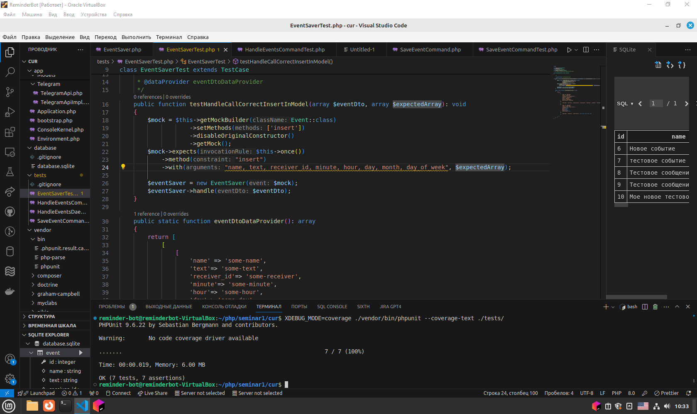
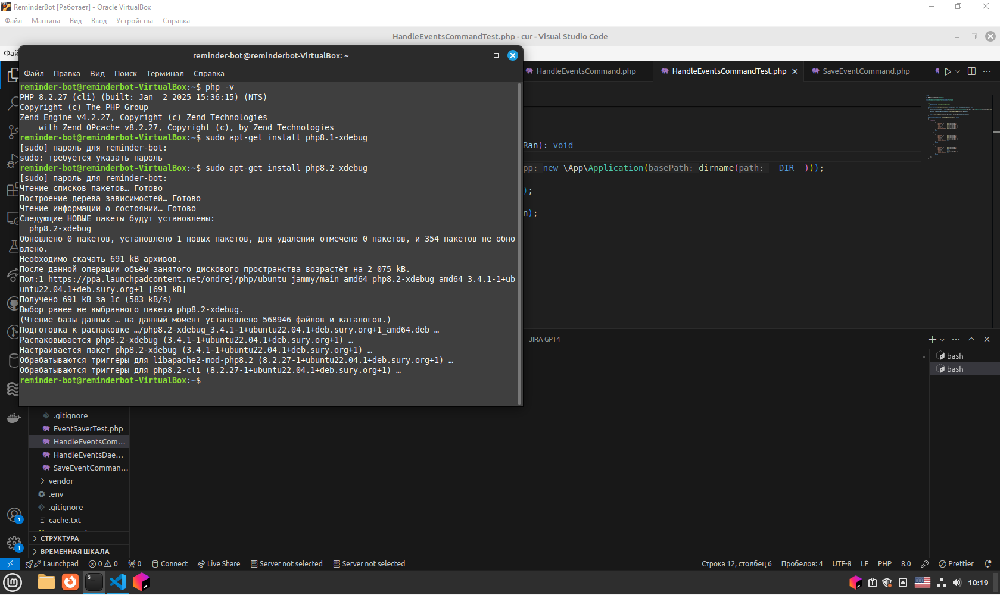
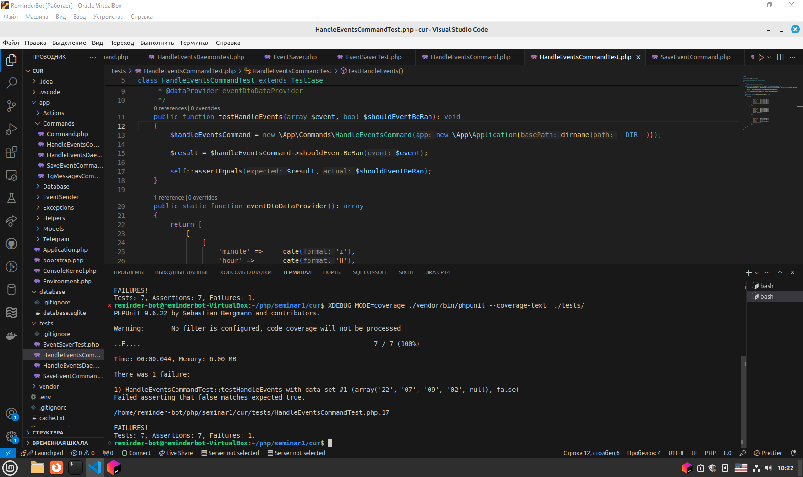

# reminger-tg-bot

## Семинар 4

---


## В любой воскресный день тест testHandleEvents в классе HandleEventsCommandTests, проверяющий поведение метода shouldEventBeRan класса HandleEventsCommand падает со вторым набором данных,

```
[
    [
        'minute' =>     date('i'),
        'hour' =>       date('H'),
        'day'=>         date('d'),
        'month'=>       date('m'),
        'day_of_week'=> null
    ],
false
]
```


## так как преобразование к целому числу строки "0" и null к целому числу дает значение 0, а в воскресный день значение day_of_week имеет значение "0"   


## Покрытие тестами:







